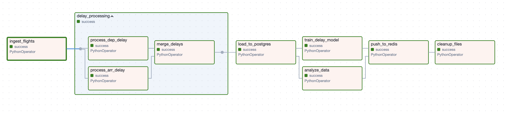
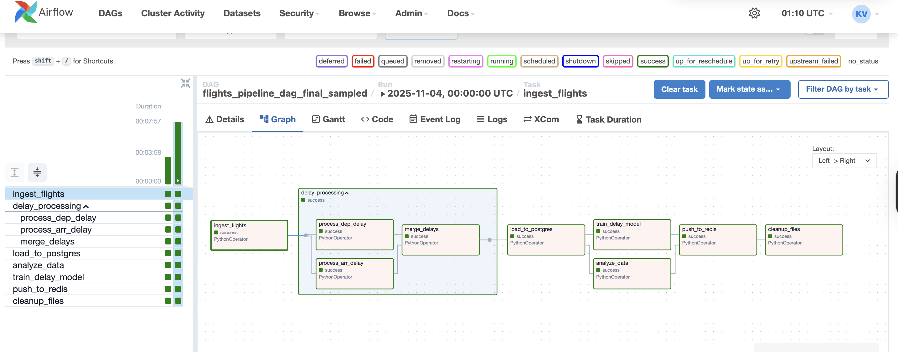
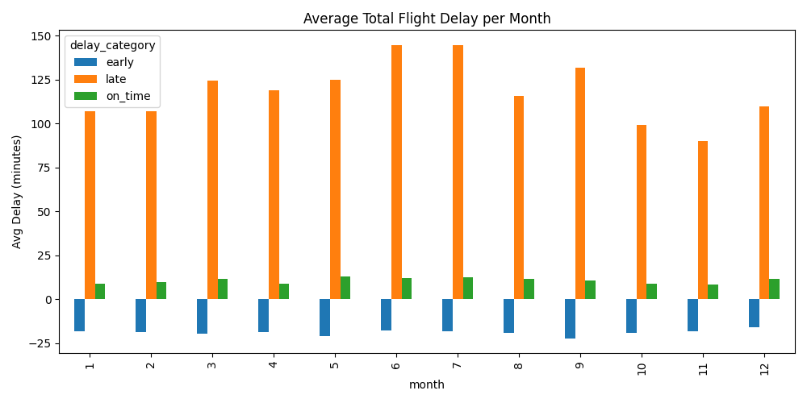
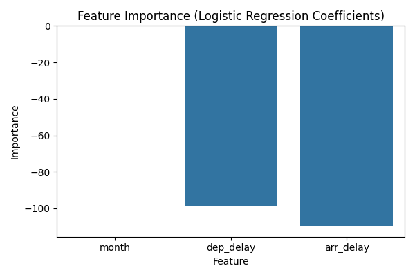
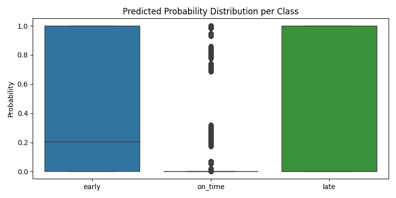
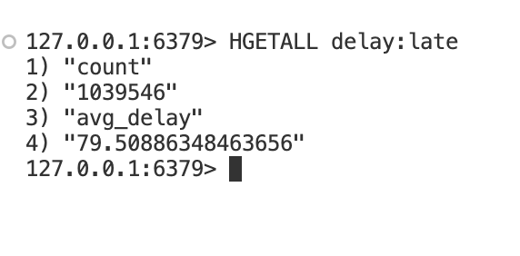

# ✈️ Flight Delay Analytics & Prediction Pipeline (Apache Airflow + Postgres + ML)

This project implements a **modular, production-style data pipeline** using **Apache Airflow** for **flight delay analytics and machine learning prediction**.  
It automates **daily ingestion, transformation, database loading, model training, and predictive inference** using modern data engineering practices.

---

## 🧭 Project Overview

The goal is to build an **end-to-end orchestration pipeline** that:

1. Ingests raw flight data (`flights.csv`)
2. Cleans and transforms departure & arrival delays
3. Merges the datasets and computes derived metrics
4. Loads processed data into a **PostgreSQL data warehouse**
5. Performs **data analysis and visualization**
6. Trains a **machine learning model** to predict delay categories
7. Stores summary metrics in **Redis** for fast access
8. Cleans up intermediate artifacts to maintain a lean workflow
9. Ingests related **weather data** (`weather.csv`) and joins it with flights for richer analysis

The pipeline runs **daily** via Airflow’s scheduler, simulating an incremental data engineering workflow with predictive analytics.

---

## ⚙️ Architecture

### **High-Level Workflow**

```
┌────────────────────────────────────┐
│ 1️⃣ Ingest Flights & Weather Data   │
└──────────┬─────────────────────────┘
           ▼
┌──────────┴─────────┐
│ 2️⃣ Transform Delays │
└──────────┬─────────┘
           ▼
┌──────────┴─────────┐
│ 3️⃣ Merge & Load DB │
└──────────┬─────────┘
           ▼
┌──────────┴──────────────────┐
│ 4️⃣ Train ML Model (LogReg)  │
│ 5️⃣ Analyze & Visualize      │
└──────────┬──────────────────┘
           ▼
┌──────────┴─────────┐
│ 6️⃣ Cache in Redis  │
└──────────┬─────────┘
           ▼
┌──────────┴─────────┐
│ 7️⃣ Cleanup Files   │
└────────────────────┘
```


### **Tech Stack**

| Component | Purpose |
|------------|----------|
| **Apache Airflow** | Workflow orchestration, parallel task management |
| **PostgreSQL** | Persistent analytical data store |
| **Redis** | Fast key-value store for caching summary metrics |
| **Pandas** | Data ingestion and transformation |
| **Matplotlib** | Visualization and report generation |
| **Scikit-learn** | Machine learning model training & evaluation |
| **Joblib** | Model serialization |
| **Docker Compose** | Multi-container environment setup |

---

## 📦 DAG Design & Tasks

### **DAG ID:** `flights_pipeline_dag_final_sampled`

| Step | Task ID | Description | Output |
|------|----------|--------------|---------|
| 1️⃣ | `ingest_flights` | Loads raw `flights.csv` (10% sample) | `flights_raw.parquet` |
| 1b | `ingest_weather` | Loads weather data (`weather.csv`) used to enrich flights | `weather.parquet` |
| 2️⃣ | `delay_processing` (TaskGroup) | Parallel processing of departure & arrival delays | `dep_delay.parquet`, `arr_delay.parquet` |
| 3️⃣ | `merge_delays` | Joins dep/arr delay tables, computes `total_delay` & category | `flights_merged.parquet` |
| 4️⃣ | `load_to_postgres` | Writes merged data into Postgres (`fact_flights`) | Database table |
| 5️⃣ | `analyze_data` | Aggregates & plots average delay by month/category | `avg_delay_by_month.png` |
| 6️⃣ | `train_delay_model` | Trains logistic regression classifier for delay prediction | `delay_model.pkl`, `delay_scaler.pkl` |
| 7️⃣ | `push_to_redis` | Caches aggregate metrics into Redis | Redis hashes |
| 8️⃣ | `cleanup_files` | Removes temporary parquet files | Clean workspace |

---

## 🧠 Machine Learning Model

The ML step (`train_delay_model`) builds a **multiclass Logistic Regression** classifier that predicts the **delay category** of a flight:
- `0 → early`
- `1 → on_time`
- `2 → late`

**Features Used:**
- `month`
- `dep_delay`
- `arr_delay`

**Pipeline:**
1. Train/test split (80/20)
2. Feature scaling (`StandardScaler`)
3. Logistic Regression (multiclass)
4. Model evaluation (precision, recall, F1-score)
5. Model + Scaler saved with `joblib`

This model is retrained daily to capture evolving flight delay trends, making it suitable for incremental learning and real-time inference.

---

## 📈 Output Artifacts

| File / Table | Description |
|---------------|--------------|
| `/opt/airflow/analysis/avg_delay_by_month.png` | Visualization of average delays per month |
| `/opt/airflow/analysis/delay_model.pkl` | Trained ML model |
| `/opt/airflow/analysis/delay_scaler.pkl` | Corresponding feature scaler |
| `fact_flights` (Postgres) | Cleaned and merged flight data |
| `Redis Keys: delay:*` | Cached metrics for quick lookup |
| `/opt/airflow/data/processed/*.parquet` | Intermediate transformation outputs |
| `/opt/airflow/data/processed/weather.parquet` | Processed weather dataset used to enrich flights |

---

## 🚀 Deployment

### 1️⃣ Clone the Repository
```bash
git clone https://github.com/<your-username>/flight-delay-pipeline.git
cd flight-delay-pipeline
```

### 2️⃣ Start Airflow Environment
```bash
docker-compose up -d
```


This starts:
- Airflow Webserver (localhost:8080)
- Scheduler
- Postgres
- Redis
- Worker

### 3️⃣ Place the Dataset
Copy your dataset into the shared data volume:
```bash
/opt/airflow/data/flights.csv
```

### 4️⃣ Trigger the DAG
Open Airflow UI → DAGs → flights_pipeline_dag_final → Trigger DAG

Or run manually:
```bash
docker exec -it docker-airflow-scheduler-1 airflow dags trigger flights_pipeline_dag_final
```


## 📈 Model Results


## 🧹 Cleanup & Maintenance

Each run automatically:
- Cleans intermediate .parquet files
- Refreshes cached metrics in Redis
- Retains database history for time-series analytics

### Successful DAG Run


*Screenshot shows a successful execution of the flight delay pipeline with all tasks completed (green)*

### Analytics & Insights

#### Flight Delay Patterns


**Key Findings:**
- **Seasonal Trends**: Higher delays observed during summer months (June-August)

## Model Plots



#### Redis Metrics Cache



These metrics are cached in Redis for fast retrieval and are updated after each pipeline run. The negative average delay for "early" category indicates these flights arrived before scheduled time.

### Why Redis for Metrics Storage?

Redis serves several critical purposes in our pipeline:

1. **Performance Optimization**
   - In-memory storage provides sub-millisecond response times
   - Reduces load on PostgreSQL for frequently accessed metrics
   - Perfect for real-time dashboards and monitoring

2. **Data Access Patterns**
   - Key-value structure ideal for categorical metrics
   - Hash data type efficiently stores multiple fields per category
   - Atomic operations ensure data consistency

3. **Operational Benefits**
   - Acts as a buffer between analysis and consumption layers
   - Enables horizontal scaling for read-heavy workloads
   - Built-in TTL capability for automatic data freshness

4. **Use Cases**
   - Real-time delay statistics for airport displays
   - Quick lookups for customer service applications
   - Live monitoring of flight performance metrics
   - API endpoints for mobile apps and web services

By using Redis alongside PostgreSQL, we create a robust two-tier storage strategy:
- PostgreSQL: Durable storage, complex queries, historical analysis
- Redis: Fast access, real-time metrics, high-concurrency reads

## 🧩 Future Enhancements

- Incremental ingestion (daily append instead of full load)
- Real-time predictions using latest trained model
- Replace Logistic Regression with RandomForest or XGBoost
- Integrate Airflow Sensors for event-driven runs
- Deploy Streamlit dashboard for live monitoring